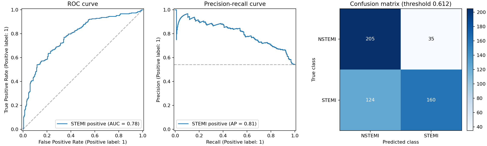

# ECG-only STEMI versus NSTEMI baseline



## Scope and limitations

This experiment uses one ECG per patient and evaluates a local held-out test only. Hidden publisher labels were not evaluated.
The source population was selected for angiography;
these results do not describe unrestricted screening performance. This is ECG-only STEMI
versus NSTEMI subtype classification, not MI detection. The fixed waveform features are
heuristic features, not clinical ST-segment measurements.

## Cohort and split

```json
{
  "cohort_patients": 2625,
  "cohort_records": 2625,
  "eligible_records": 2677,
  "exact_duplicate_records_excluded": 0,
  "excluded_both_label_records": 0,
  "excluded_conflict_patients": 13,
  "excluded_neither_records": 15283,
  "final_eligible_patients": 2618,
  "input_records": 17960,
  "invalid_signal_records": 7,
  "nstemi_records": 1201,
  "stemi_records": 1424
}
```

| Split | Patients | STEMI | NSTEMI |
| --- | ---: | ---: | ---: |
| train | 1570 | 852 | 718 |
| validation | 524 | 284 | 240 |
| test | 524 | 284 | 240 |

## Model selection

Feature count: 664. Selected regularization C: 0.01.
The validation-selected decision threshold was 0.612.

| C | Validation AUROC |
| ---: | ---: |
| 0.01 | 0.768 |
| 0.1 | 0.749 |
| 1.0 | 0.729 |

## Local held-out test metrics

| Metric | Model |
| --- | ---: |
| AUROC | 0.784 |
| Average precision (AP; not trapezoidal PR AUC) | 0.807 |
| Accuracy | 0.697 |
| Balanced accuracy | 0.709 |
| Sensitivity (STEMI) | 0.563 |
| Specificity (NSTEMI) | 0.854 |
| Precision (STEMI) | 0.821 |
| F1 (STEMI) | 0.668 |
| Brier score | 0.190 |

## Dummy baseline metrics

The dummy predicts the training STEMI prevalence for every patient and uses a fixed
threshold of 0.5; the trained model uses its validation-selected threshold.

| Metric | Dummy baseline |
| --- | ---: |
| AUROC | 0.500 |
| Average precision (AP; not trapezoidal PR AUC) | 0.542 |
| Accuracy | 0.542 |
| Balanced accuracy | 0.500 |
| Sensitivity (STEMI) | 1.000 |
| Specificity (NSTEMI) | 0.000 |
| Precision (STEMI) | 0.542 |
| F1 (STEMI) | 0.703 |
| Brier score | 0.248 |

## Patient-bootstrap confidence intervals

Intervals are patient-bootstrap intervals with the model fixed; they quantify sampling
uncertainty on this local test cohort and do not provide external validation.

| Metric | 95% interval |
| --- | --- |
| auroc | [0.744, 0.820] |
| average_precision | [0.762, 0.854] |
| balanced_accuracy | [0.672, 0.742] |
| sensitivity | [0.505, 0.619] |
| specificity | [0.809, 0.900] |

## Reproducibility

```json
{
  "config": {
    "feature_version": "1.0",
    "n_bootstrap": 1000,
    "one_ecg_per_patient": true,
    "seed": 42,
    "selection_metric": "validation AUROC",
    "target": "STEMI=1, NSTEMI=0",
    "threshold_rule": "validation maximum Youden J; nearest 0.5 breaks ties"
  },
  "provenance": {
    "dataset_doi": "10.6084/m9.figshare.29925314",
    "metadata_sha256": "15fdb9b576da88acc31d07612e457848a3d3502ea4955ffd3fed845968310907",
    "packages": {
      "matplotlib": "3.10.9",
      "numpy": "2.2.6",
      "pandas": "2.3.3",
      "scikit-learn": "1.7.2",
      "scipy": "1.15.3",
      "wfdb": "4.3.1"
    },
    "paper_doi": "10.1038/s41597-026-07278-0",
    "python": "3.10.11",
    "source_manifest": {
      "article_id": 29925314,
      "doi": "10.6084/m9.figshare.29925314.v1",
      "files": [
        {
          "download_url": "https://api.figshare.com/v2/file/download/62951134",
          "id": 62951134,
          "md5": "1cb46279c0e68e6512bd39214fc56528",
          "name": "CSV.zip",
          "sha256": "675a57e90eea1175259301293812ec0a23c73f83ec7fb352a8309f05843d0005",
          "size": 296769
        },
        {
          "download_url": "https://api.figshare.com/v2/file/download/62951395",
          "id": 62951395,
          "md5": "acea6ca86a2d0b937ecfe7d1df6d30a2",
          "name": "ECG_row_data.zip",
          "sha256": "9a5a1bf1655b28d09de152bd4bf443c491cef4a1adff108b40938ee90e6693c4",
          "size": 1277577332
        }
      ],
      "license": {
        "name": "CC0",
        "url": "https://creativecommons.org/publicdomain/zero/1.0/",
        "value": 2
      },
      "published_date": "2026-07-09T07:01:18Z",
      "source": "Figshare",
      "title": "A large-scale 12-lead electrocardiogram dataset for acute coronary syndrome prediction containing 19,955 ECGs",
      "version": 1
    }
  }
}
```
